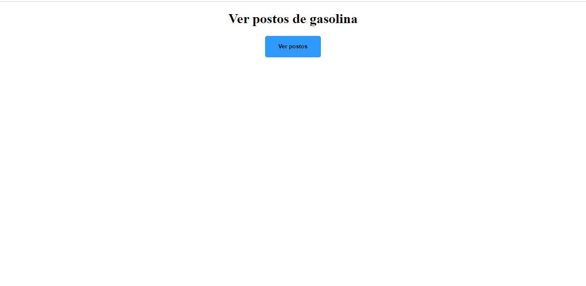
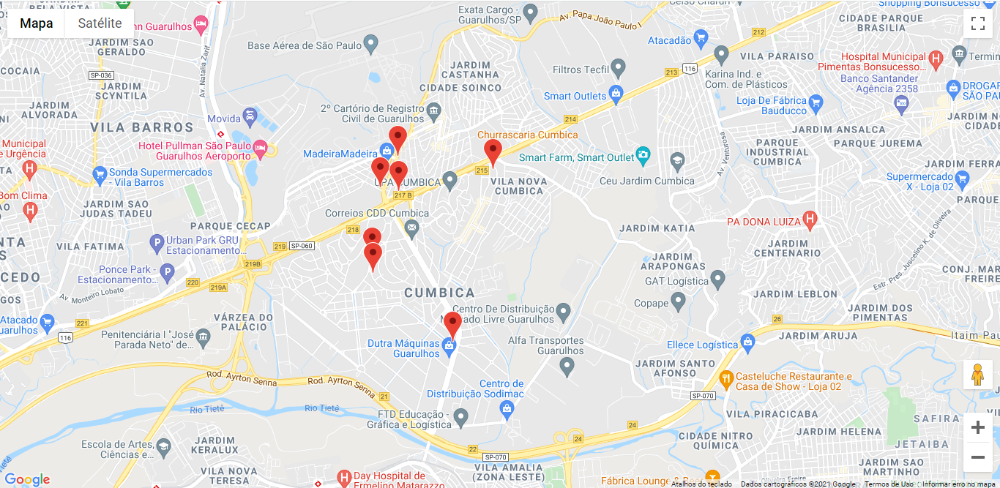

<h1>Google maps api Project</h1>
Projeto desenvolvido com google maps api
Este projeto consiste em buscar postos de gasolina de acordo com a localização do usuario.

Ao clicar nos pontos marcados é retornado um informações sobre o local.

##

